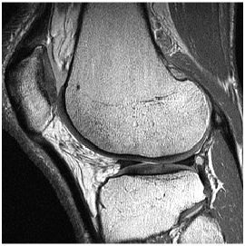
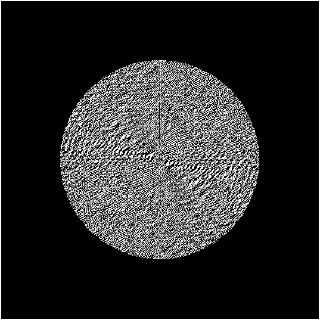
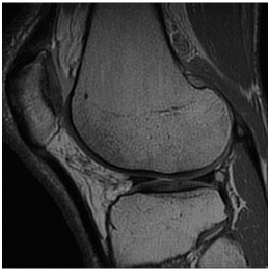

# 2D-DFT

This project applies the 2 Dimensional Fast Discrete Fourier Transformation (DFT) to test Low Pass Filters (LPF) in gray-scale images and show the advantages of the frequency domain for image processing. The code was developed on Matlab and takes 2D grey-scaled .pgm images, zero-pads, centers its frequency and moves them into the frequency domain using the Fast 2D DFT algorithm to then apply a LPF for smoothing and then uses the inverse DFT to recover the filtered image. 

